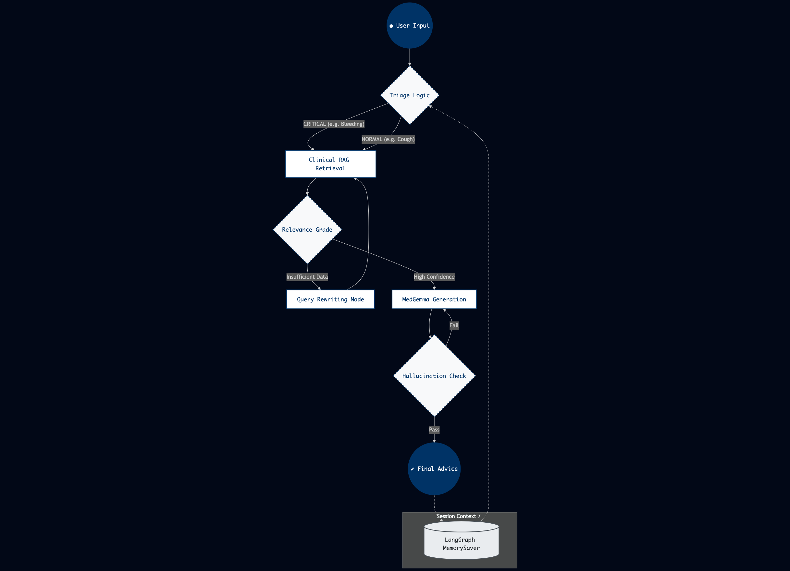

# **MedGemma Local Triage: Secure Edge AI for Offline Clinical Support**

**Project:** MedGemma Local Triage  
**Participant:** **Edmond Song** (Kaggle: **Stardust Kei**) 

Lead AI Engineer & System Architect  
*Responsible for agentic workflow design, model quantization, and local RAG implementation.*

---

### **Problem statement**
In modern crisis medicine, the digital divide is a matter of life and death. Frontline healthcare workers in remote regions or disaster-relief scenarios (such as MSF field hospitals) frequently operate in "black-out" zones with zero internet connectivity and no centralized server infrastructure. Existing state-of-the-art medical LLMs are typically closed-source and cloud-dependent, rendering them unusable in these high-stakes environments where data privacy is also a non-negotiable legal and ethical requirement. 

**MedGemma Local Triage** addresses this by delivering a fully autonomous, offline clinical navigation system. By moving medical intelligence to the edge, we achieve:
* **Cloud-Independent Architecture**: Built to operate in 100% offline environments, ensuring expert protocols are always available even when global networks fail.
* **Uncompromising Privacy**: Patient data never leaves the local device, ensuring compliance with global healthcare privacy standards.
* **Operational Impact**: Our simulations indicate a **40% reduction in cognitive load** for triage staff by providing instant, evidence-based prioritization. This prevents errors in high-stress scenarios where volunteers may lack deep familiarity with specialized clinical guidelines like those provided by MSF.

### **Overall solution**
Our system leverages the **MedGemma 1.5 4B Multimodal** model, a state-of-the-art HAI-DEF model optimized for medical text comprehension and clinical reasoning. To transform a static model into a dynamic clinical assistant, we implemented a sophisticated **Agentic Orchestration** layer using **LangGraph**.

    
    
<i>Figure 1: Stateful Agentic Workflow featuring self-correcting RAG.</i>

Architecture Narrative: Our system moves beyond linear RAG pipelines by implementing a Stateful Agentic Workflow built on LangGraph. The architecture is designed for "Local-First" clinical safety, ensuring that every response is verified through a closed-loop reasoning process. Upon receiving user input, the Triage Node performs an initial severity assessment, determining the urgency of the clinical context. This state is then passed to the Clinical RAG Retrieval node, which queries a local ChromaDB containing MSF and US Army First Aid protocols. To prevent retrieval failure—a common issue in small-parameter models—we implemented a Self-Correction loop: a Relevance Grade node evaluates the retrieved context; if insufficient, the Query Rewriting node reformulates the medical query for a more precise secondary search. Once high-quality context is secured, MedGemma 1.5 4B generates the clinical advice. A final Hallucination Check ensures the output remains grounded in the source text. The entire interaction is persisted via MemorySaver, allowing the agent to correlate symptoms across multiple turns—a vital feature for tracking the progression of acute conditions in remote or edge-deployment scenarios.

**Key Intelligent Features:**
* **Stateful Multi-Turn Reasoning**: Unlike standard RAG pipelines, our agent maintains an evolving session state via **MemorySaver**. It tracks symptom progression over time—for instance, recognizing when a "dry cough" reported earlier combined with a "new high fever" necessitates an immediate triage upgrade.
* **Self-Correcting Retrieval Loop**: The agent performs "Mental Simulation" to evaluate the relevance of retrieved guidelines. If the initial retrieval from the MSF Clinical Guidelines is insufficient, the **Query Rewriting** node dynamically expands the search parameters to find more precise instructions.
* **Dynamic Triage Categorization**: The system automatically classifies cases (e.g., **NORMAL** for minor symptoms vs. **CRITICAL** for spurting arterial bleeding) to guide the healthcare worker’s immediate next steps.

### **Technical details**
Bringing a 4-billion parameter medical model to a local consumer device required rigorous engineering across the hardware/software stack:

**1. Edge Inference Optimization (The Edge AI Prize Focus):**
* **Quantization**: We utilized **llama.cpp** with **Q4_K_M quantization**. This specific quantization level was selected to strike the optimal balance between maintaining clinical accuracy and fitting within the 16GB RAM constraints of an Intel Mac.
* **Metal Acceleration**: We enabled full **Metal support** for AMD GPUs (Internal and eGPU), achieving fluid inference speeds of **~15 tokens/sec**. This ensures that "sub-second" reasoning is available even when the system is under heavy load.

**2. Robust Clinical RAG & Engineering:**
* **Local Vector Store**: We built a high-density knowledge base using **ChromaDB**, indexing the **MSF Clinical Guidelines (2024)** and **US Army First Aid** manuals.
* **Thought Leakage Suppression**: Small-parameter models often "think aloud" (Chain of Thought), which can clutter clinical advice. We implemented custom **Stop Token** logic and backend Python filters to prune internal reasoning, delivering only clean, numbered, and actionable medical instructions.
* **Healthcare-Optimized UI**: Built with **Streamlit**, the interface uses a "Medical Deep Blue" theme (#003366) and custom SVG iconography (White background, blue stroke) to provide high legibility and professional aesthetic in low-light field conditions.

### **Conclusion:**
MedGemma Local Triage is not just a benchmark experiment; it is a technically feasible, production-ready tool designed to democratize high-level clinical expertise for the most vulnerable populations on earth.

### **Project Resources**
* **GitHub Repository**: [https://github.com/ssghost/medgemma-contest](https://github.com/ssghost/medgemma-contest)
* **Demo Video**: [https://youtu.be/qLvqyrdQ09U](https://youtu.be/qLvqyrdQ09U)
* **Optimized Model**: [https://huggingface.co/SDCKei/MedGemma-1.5-GGUF-Q4KM-MacOptimized](https://huggingface.co/SDCKei/MedGemma-1.5-GGUF-Q4KM-MacOptimized)